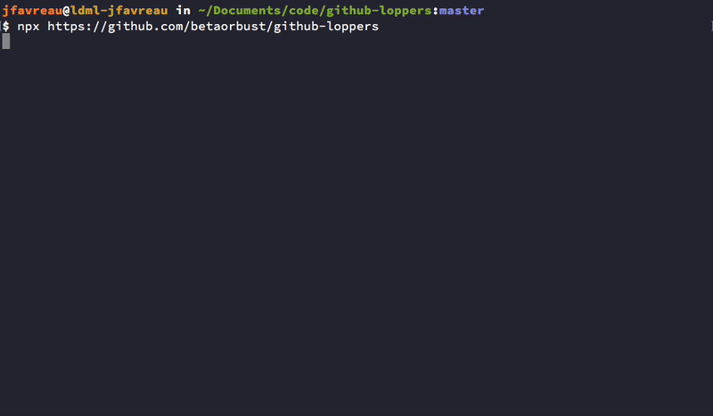

# Delete Squash-merged local Git Branches


A node utility to delete local branches that have already been merged into a
mainline via the squash-merge strategy. (Frequently
[used on Github](https://blog.github.com/2016-04-01-squash-your-commits/).)

With normal merge commits, you can run `git branch --merged` to get a list of
already-merged branches, but with squash-merge you end up with new commits that
contain your feature branch's work.

This util will find those already-squashed-and-merged branches and optionally
delete them.

<details>
<summary>Explanation of what's going on under the hood</summary>

-   Gets the branch list by name
    -   `git for-each-ref refs/heads/ --format=%(refname:short)`
-   Then for each branch found:
    -   Find the ancestor commit where ThisBranch left BaseBranch
        -   `git merge-base <BaseBranch> <ThisBranch>`
    -   Get the tree ID
        -   `git rev-parse <ThisBranch>^{tree}`
    -   Make up a temporary commit with the contents ThisBranch squashed
        together
        -   `git commit-tree <TreeID> -p <AncestorSha> -m "Temp <ThisBranch>"`
    -   See if the temp commit contents was already applied to upstream
        -   `git cherry <BaseBranch> <TempPatchSha>`
    -   If the above output starts with `-` the branch is a candidate for
    deletion
    </details>

### Usage:

**By default, this utility runs in dry mode. You will be prompted if you
actually want to run any destructive changes.**

The easiest way to use `github-loppers` is via NPX:

```sh
cd ~/code/myProject                                # Get to your local repo
npx https://github.com/betaorbust/github-loppers   # Run the utility
```

which will temporarily fetch the dependencies and run `github-loppers` so you
can either list out or delete your stale branches.



### Requirements:

-   Node > 10
-   Git
-   That the mainline branch your checking against is checked out locally.

### Acknowledgments

Git logic from @not-an-aardvark's awesome
[bluebird-based implementation](https://github.com/not-an-aardvark/git-delete-squashed).
